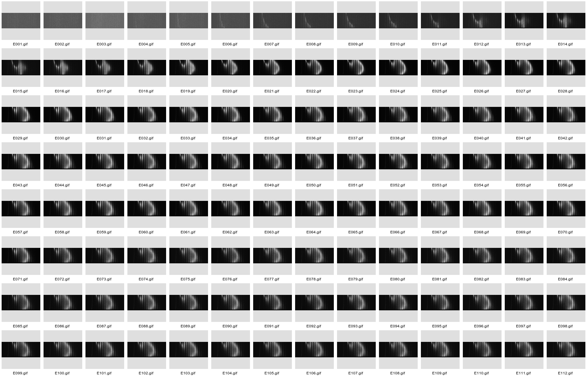
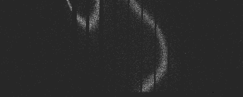
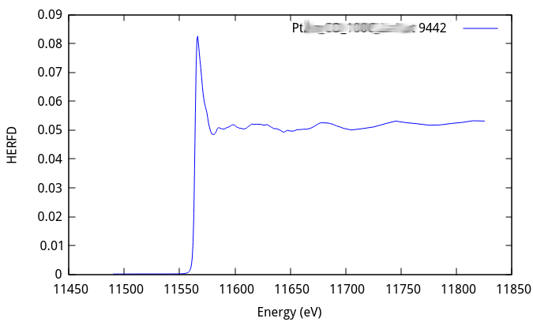

..
   The Xray::BLA and Metis document is copyright 2016 Bruce Ravel and
   released under The Creative Commons Attribution-ShareAlike License
   http://creativecommons.org/licenses/by-sa/3.0/

High energy resolution fluorescence detection (HERFD)
=====================================================

Here is an example of a high energy resolution fluorescence detection
(HERFD) measurement of the Pt L\ :sub:`III` edge using the L\ |alpha|\
:sub:`1` emission line.  This montage shows a sequence of 112
exposures of the Pilatus through the energy range of the Pt L\
:sub:`III` XANES measurement.

   The HERFD measurement sequence for the Pt L\ :sub:`III` edge using
   the L\ |alpha|\ :sub:`1` emission line.

At some level, it is clear how this is a XANES spectrum.  The first
few exposures are below the edge.  There is no fluorescence below the
edge, so there little signal on the face of the detector.  As the
monochromator is scanned above the edge, the signal on the detector
grows.  Through the XAFS oscillations, the intensity of the signal on
the detector varies.

To convert these images into a spectrum, it is necessary to create a
map which translates a pixel location on the detector into an energy.
That is, the crystal disperses energy over the face of the detector.
To compute the HERFD signal, we want to include only that portion of
each image which corresponds to a narrow energy band around the L\
|alpha|\ :sub:`1` peak energy of 9442 eV.

To do this, we measure an :quoted:`elastic image` at 9442 eV.  The
elastically scattered photons at this energy are dispersed by the Laue
analyzer onto specific pixels of the detector.  These images are used
to make a mask that associates those illuminated pixels with the
energy 9442 eV.

   The measurement of the elastic scattering at 9442 eV, the peak of
   the L\ |alpha|\ :sub:`1` emission line.

The mask creation algorithm has a lot to deal with, as you can see
from the elastic montage.  The mask creation has to reject weakly
illuminated pixels on the periphery of each image, leaving only the
wiggly stripe running through the middle of the each image.  It also
must reject very bright spots due to to powder diffraction, which
occasionally occur and are often much brighter than the rest of the
image.

Here is the mask generated from the elastic image at 9442 eV.
The algorithm isolates those pixels which are obviously within the
stripes of the elastic images, setting each of those pixels to 1,
while setting all other pixels to 0.

   The mask for 9442 eV, the peak of the L\ |alpha|\ :sub:`1` emission
   line.

This mask is then applied in sequence to the images measured
throughout the range of the Pt L\ :sub:`III` edge XANES.  This is done
by multiplying the mask pixel-by-pixel with each measurement in the
scan.  This extracts only those pixels associated with the peak of the
L\ |alpha|\ :sub:`1` emission line.

The intensity of the masked pixels are summed, yielding the HERFD
signal at that energy.  This is repeated for each energy point,
yielding the HERFD spectrum.

   The HERFD using the 9442 eV mask.

The command for making that HERFD spectrum from the collection of images is

.. code-block:: console

   bla herfd -e 9442 -c PtLa1.ini Pt_La1

Here ``Pt_La1`` is the :quoted:`stub`, i.e. the word which begins the
names of all files in the measurement.  The emission energy at which
to compute the HERFD is 9442 eV, specified by the ``-e`` command line
switch.  The ini file defining the parameters of the calculation is
specified with the ``-c`` switch.

Here is the ini file:

.. code-block:: bash

   [measure]
   emission           = 9429 to 9454 by 1
   scanfolder         = /home/bruce/Data/herfd_data
   tiffolder          = /home/bruce/Data/herfd_data
   outfolder          = /home/bruce/Data/NIST/herfd_data/process
   element            = Pt
   line               = La1
   tiffcounter        = 001
   energycounterwidth = 3
   imagescale         = 40
   outimage           = gif

   [files]
   scan               = %s.001
   elastic            = %s_elastic_%T_001.tif
   image              = %s_%c.tif
   xdi                = /home/bruce/git/BLA-XANES/share/bla.xdi.ini

   [steps]
   steps = <<END
   bad 400 weak 0
   gaussian 2
   andmask
   END

The ``[measure]`` block defines the measured elastic energys, the
locations on input and output files, and various other parameters.
The ``[files]`` block defines mini-templates used by Xray::BLA to
construct input and output file names.  The ``[steps]`` block gives
the recipe for creating the mask from the elastic energy image.

