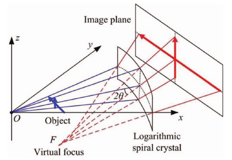

..
   The Xray::BLA and Metis document is copyright 2016 Bruce Ravel and
   released under The Creative Commons Attribution-ShareAlike License
   http://creativecommons.org/licenses/by-sa/3.0/

Overview of the BLA measurement
===============================

The spectrometer for which this software was developed uses a bent
Laue analyzer of the sort first described by Zhong et al.  The
analyzer is in the form of a log-spiral.  A sheet of silicon crystal
(most of the examples in this document use a Si (220) crystal) is
pressed against this log-spiral surface.

The log-spiral is the shape that preserves the divergence of the
signal fluorescing from a sample as the light is diffracted from
the planes of the crystal.  This, then, serves to spatially separate
the light diffracted by the crystal from the light transmitted through
the crystal, as seen in this schematic:

   
   Schematic of the log-spiral bent Laue analyzer, taken from figure 1
   in Wu et al.

If an area detector is placed far enough away from the analyzer, only
the light diffracted by the crystal will be incident upon the face of
the detector.

   .. bibliography:: ../bla.bib
      :filter: author % "Zhong" or author % "Wu"
      :list: bullet

In practice, it is useful to use some kind of collimator, such as
Soller slits, to suppress background on the detector from light
scattering from other parts of the experiment.

Here is a photograph of the spectrometer as it was used in February 2016.

.. figure:: ../_images/experiment.jpg
   :target: ../_images/experiment.jpg
   :width: 40%
   :align: center

The shrouded box at the far right of the photo contains the
Kirkpatrick-Baez focusing mirrors used to deliver a 10s-of-microns
sized small spot to the sample.  The shielding is in place to keep
light from scattering off the mirror and into the detector.

The sample is mounted on an XY stage with an optical camera observing
the sample.

The analyzer is the shiny object just below and to the left of the
center of the center of the photo.  The shiny part is the Si (220)
crystal.  The aluminum frame around the Si is made in the log-spiral
shape.

The sheets of metal between the sample and the analyzer are for
shielding light that might scatter from the region of the sample in
the direction of the detector.

Suspended at the appropriate angle to intercept the light diffracting
from the analyzer is a `Pilatus area detector
<https://www.dectris.com/pilatus3-r-s-and-x.html>`_.  Between the
analyzer and the Pilatus are a set of Soller slits.

Several parts of the spectrometer are actuated.  The sample can be
moved in the incident beam.  The optical camera is used to bring the
surface of the sample to the same spot after a sample change.

The analyzer can rotate about it's diffraction axis and can move
closer to or farther from the sample.  Together, these motions bring
the analyzer into focus with the sample at a given energy.

The Pilatus is rotated to twice the angle of the analyzer crystal so
that the diffracted light enters its window.

In the following sections, examples of HERFD, XES, and RIXS
measurements using the instrument are shown.

