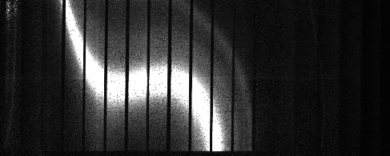
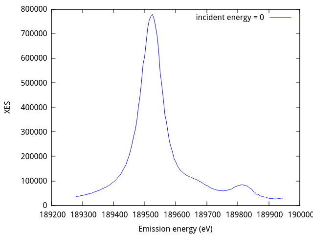
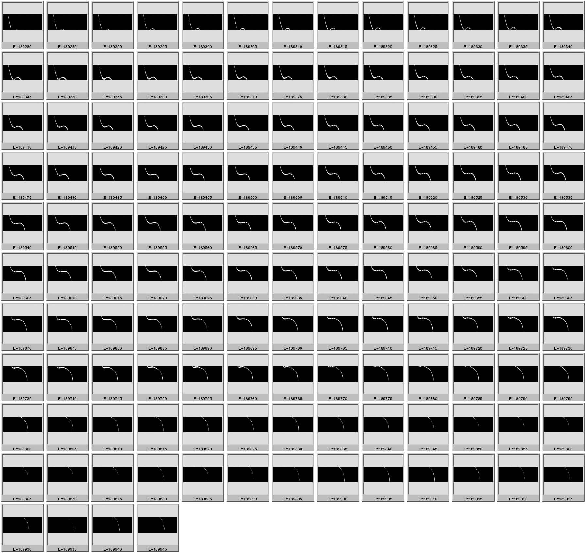

..
   The Xray::BLA and Metis document is copyright 2016 Bruce Ravel and
   released under The Creative Commons Attribution-ShareAlike License
   http://creativecommons.org/licenses/by-sa/3.0/

Non-resonant X-ray Emission Spectroscopy (XES)
==============================================

In this example, the non-resonant X-ray emission spectroscopy of the
K\ |beta|\ :sub:`2,4` emission line of Nb\ :sub:`2`\ O\ :sub:`5` is
measured.  The monochromator is moved to 19100 eV, an energy above the
Nb K edge, thus exciting all the Nb K\ |alpha| and K\ |beta| emission
lines.

Here is the image dispersed by the spectrometer onto the detector:

   Non-resonant XES measurement of Nb\ :sub:`2`\ O\ :sub:`5`, measured
   at 19100 eV.  The brightness of the image has been enhanced so that
   the dim features are visible.

The K\ |beta|\ :sub:`2` is the over-saturated stripe in this
image.  To the right, which is the high energy side of the image,
there are two additional features associated with the 
K\ |beta|\ '' and K\ |beta|\ :sub:`4` emission lines.  These smaller
features can be seen clearly in the processed data:

   The XES spectrum of Nb\ :sub:`2`\ O\ :sub:`5` extracted from the image.

To convert the image above into this spectrum, we need to translate
the pixels in the image into energy.  Similar to the HERFD
measurement, this is done by measuring a sequence of images with the
monochromator set to energies spanning the energy range of the
emission line.  In the case of the Nb K\ |beta|\ :sub:`2,4` emission
line, elastic images are measured from 18928 eV to 18994.5 eV,

From each elastic image, a mask is made.  Each mask, then, defines the
pixels which are illuminated by photons of that energy being dispersed
through the spectrometer crystal.

At each energy in the range from 18928 eV to 18994.5 eV, the mask is
multiplied by the non-resonant XES image above.  The illuminated
pixels are summed and that sum is the emission intensity at that
energy.  In this way, the XES spectrum is constructed.

Here are the masks at each energy through the emission peak.

   The sequence of masks made from elastic images measured from 18928
   eV to 18994.5 eV,

Here, in full size, are the masks from the peaks of the Nb K\ |beta|\
:sub:`2` and Nb K\ |beta|\ :sub:`4` emission lines at 18952.5 eV and
18981.5 eV

.. subfigstart::

   The mask for the peak of the Nb K\ |beta|\ :sub:`2` emission line

   The mask for the peak of the Nb K\ |beta|\ :sub:`4` emission line

.. subfigend::
   :width: 0.4
   :label: _fig-xesmasks

This command is used to create the masks and compute the XES
spectrum.  In this case, ``Nb2O3_Kb2_2`` is the file name stub.  

.. code-block:: console

   bla xes -c ini/Nb2O3.ini --noscan --xesimage=1 -p Nb2O3_Kb2_2

The ``--noscan`` command line switch tells the :program:`bla` program
that no scan file was written.  In a HERFD measurement, the scan file
is used to map incident energy values to each image in the HERFD
measurement.  It is also used to record I\ :sub:`0` and other
detectors.  For a non-resonant XES measurement, this file is not
written.  Emission energy values are encoded in the file names of the
elastic images.  File names are determined from the parameters in the
``[files]`` block of the ini file.

The ``--xesimage`` switch tells the :program:`bla` program which
non-resonant XES image to process.  In this experiment, the XES
spectrum was measured 8 times and this command processes the first
measurement.

Here is the ini file specified by the ``-c`` switch.  The ``[spots]``
block is used to manually remove regions of the image from processing.
The polyfill step of the mask creation recipe is sensitive spurious
signal, such as from diffraction peaks.  The ``xrange`` parameter sets
the range in width of the image which contains all the signal from the
sequence of elastic images.  Pixels outside that range in width are
set to 0 in the mask, which helps to normalize the polyfill step.

.. code-block:: bash

   [measure]
   emission           = 189280 to 189945 by 5
   scanfolder         = /home/bruce/Data/NIST/10ID/2016.02/Nb2O3_2
   tiffolder          = /home/bruce/Data/NIST/10ID/2016.02/Nb2O3_2
   outfolder          = /home/bruce/Data/NIST/10ID/2016.02/Nb2O3_2/processed
   element            = Nb
   line               = Lb2
   tiffcounter        = 0001
   energycounterwidth = 4
   imagescale         = 40
   outimage           = gif

   [files]
   scan               = %s.001
   elastic            = %s_elastic_%e_%t.tif
   image              = %s_%c.tif
   xdi                = ini/nb.xdi.ini

   ## Nb2O3_2
   [spots]
   xrange = 60 336
   
   [steps]
   steps = <<END
   bad 400 weak 0
   gaussian 1.7
   useshield 12
   polyfill
   END

