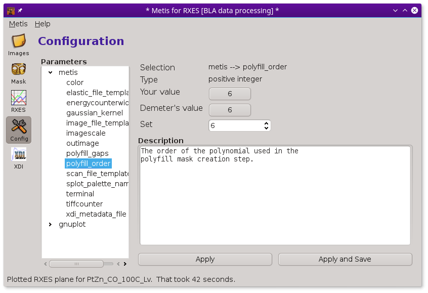

..
   The Xray::BLA and Metis document is copyright 2016 Bruce Ravel and
   released under The Creative Commons Attribution-ShareAlike License
   http://creativecommons.org/licenses/by-sa/3.0/

The Configuration tool
======================

:demeter:`metis` uses the same configuration infrastructure as the
other :demeter:`demeter` GUIs.  If you have used the configuration
tool in :demeter:`athena`, :demeter:`artemis`, or
:demeter:`hephaestus`, then you know how to use this one.

   :demeter:`metis`'s configuration tool.

Here links to the configuration documentation in `Athena
<http://bruceravel.github.io/demeter/documents/Athena/other/prefs.html>`_
and `Artemis
<http://bruceravel.github.io/demeter/documents/Artemis/prefs.html>`_.
Here is the explanation from the `Demeter Programming Guide
<http://bruceravel.github.io/demeter/documents/DPG/highlevel/config.html>`_.

The configuration parameters will be saved in the same
:file:`demeter.ini` file that is used by the other :demeter:`demeter`
programs.  On linux (and other unixes) this is in ``$HOME/.horae/``. On
Windows this is in ``%APPDATA%\\demeter``.
