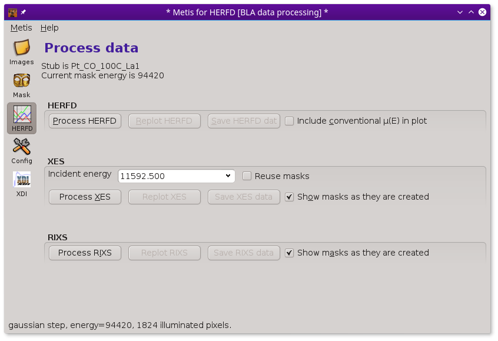

..
   The Xray::BLA and Metis document is copyright 2016 Bruce Ravel and
   released under The Creative Commons Attribution-ShareAlike License
   http://creativecommons.org/licenses/by-sa/3.0/

The Data tool
=============

Once you have established a recipe for mask creation, you are ready to
begin processing your resonant or non-resonant XES images.  Clicking
on the Data icon in the tool bar shows this page.

.. figure:: ../_images/metis_data.png
   :target: ../_images/metis_data.png
   :align: center

   :demeter:`metis`'s data processing tool.

Note that the Data icon has the same label as the mode in which
:demeter:`metis` was invoked.  In this case, it was involked in XES
mode, so the label says :guilabel:`XES`.

In XES mode, the only set of controls shown are those related to
computing and displaying XES spectra.  See below for examples of 
:demeter:`metis` in HERFD or XES mode.

The drop down menu at the top of the XES box is filled with the
contents of the :guilabel:`Image files` list from the `Files page
<files.html>`_.  Clicking the :button:`Process XES,light` button
processes the XES images one at a time using the mask recipe from the
`Mask page <mask.htmls>`_.

When clicked on, the :guilabel:`Reuse masks` button tells
:demeter:`metis` to reuse the set of masks calculated at each elastic
energy when processing the current image file.  It takes a few 10s of
seconds to work through the entire list of elastic energies.  However,
reapplying a set of calculated masks to a new image takes only a
fraction of a second.  Clicking this button off will force a
recalculation of the entire set of masks.

.. subfigstart::

   The XES image measure on NbF\ :sub:`5`.  The K\ |beta|\ :sub:`1,3`
   is the bright stripe in  the image.  The distinct, but much dimmer
   stripe to the bottom and right of the image is the K\ |beta|\
   :sub:`2,5`.  The K\ |beta|\ |dprime| signal is in the broad, diffuse
   signal between the two peaks.  The vertical stripes are from the
   Soller slits used to help suppress scattering from elsewhere in the
   beam path, thus reducing the background signal.

.. figure:: ../_images/nbf5_xes.png
   :target: ../_images/nbf5_xes.png
   :align: center

   The XES spectrum computed for NbF\ :sub:`5`.  The K\ |beta|\
   :sub:`1,3` is the large peak at 18952 eV, the The K\ |beta|\
   :sub:`2,5` is the smaller peak at 18980 eV.  The K\ |beta|\
   |dprime| is the sort-of-shoulder above 18960 eV.

.. subfigend::
   :width: 0.4
   :label: _fig-nbf5xes

The :button:`Replot XES,light` button will replot the current image
file, reapplying the masks if required.  The :button:`Save XES
data,light` button will prompt for a file name, then write the XES
data from the current image as an `XDI file
<https://github.com/XraySpectroscopy/XASDataLibrary>`_.  The columns
of that file are energy, computed XES, number of illuminated pixels in
each mask, and the unscaled signal at each energy.

The :button:`Process each XES image,light` button will calculate the
set of masks then apply them to each of the measured images.  It will
also compute the average of the XES spectra then plot each measurement
along with the average.  The :button:`Save all XES data,light` button
will write out the entire set of XES data to an `XDI file
<https://github.com/XraySpectroscopy/XASDataLibrary>`_.  The columns
are energy, average XES, number of illuminated pixels in each mask,
followed by one column for each individual XES measurement.

Scaling the XES measurement
---------------------------

The reported XES spectrum is scaled by the number of illuminated
pixels in the mask.  The mask is multiplied by the XES image and this
product is summed.  That yields the photon count in those pixels
falling under the mask at each energy.  However, there is a
significant discrepancy in the number of pixels actually illuminated
at each energy.  This has to do with the details of the geometry of
the spectrometer and how each energy interacts with the analyzer
crystal.

To approximate this geometry effect, each raw photon count is scaled
by the number of pixels involved in the measurement.  The elastic mask
with the largest number of illuminate pixels has a scaling factor
of 1.  All other masks are scaled by ``N_pixels / N_largest``.
Elastic energies with relatively small illuminated pixel counts are
scaled up to approximately remove the effect of geometry.

HERFD measurements
------------------

When starting :demeter:`metis` in HERFD mode, the Data tool displays
several more controls.

   :demeter:`metis`'s data processing tool in HERFD mode.

A HERFD data set includes elastic images measured over a range of
energies surrounding a K\ |alpha|, K\ |beta|, L\ |alpha|, or L\ |beta|
peak, including the top of the measured emission line. 

.. subfigstart::

   The image for 9442 eV, the top of the Pt L\ |alpha|\ :sub:`1` line
   in a HERFD measurement on a Pt nanoparticle.

.. figure:: ../_images/pt_la_mask.png
   :target: ../_images/pt_la_mask.png
   :align: center

   The mask for the 9442 eV image, processed with a bad/weak step with
   parameters 400/1 and a Gaussian blur with a threshold of 1.4.

.. subfigend::
   :width: 0.4
   :label: _fig-ptla

The actual HERFD measurement involves measuring XES images at a range
of energies corresponding to a conventional XANES scan.   Below the
edge (left image below) there is very little fluorescence in the
image.  As the scan goes through the edge and into the EXAFS, the
fluorescence signal in the images grows, becoming quite bright with
the brightness oscillating through the EXAFS wiggles.

.. subfigstart::

   The Pt XES image at an energy in the XANES pre-edge.

.. figure:: ../_images/pt_herfd_2.png
   :target: ../_images/pt_herfd_2.png
   :align: center

   The Pt XES image at an energy somewhere in the middle of the XANES edge.

   The Pt XES image at an energy above the Pt L\ :sub:`3` edge.

.. subfigend::
   :width: 0.3
   :label: _fig-ptxes

When the :button:`Process HERFD,light` button is pressed, the mask is
applied to each of the XES images over the XANES range.  The signal
under the mask is the HERFD signal at each energy.

.. figure:: ../_images/pt_herfd.png
   :target: ../_images/pt_herfd.png
   :align: center

   The Pt HERFD computed from the sequence of XES images using the
   9442 eV mask.

If the scan file contains an obvious column for a conventionally
measured spectrum (either transmission or fluorescence with, say, a
silicon drift detector), the conventional spectrum will be overplotted
if the :guilabel:`Include conventional mu(E) in plot` button is
checked.

The HERFD data can be replotted by clicking on the :button:`Replot
HERFD,light` button.  Clicking on the :button:`Save HERFD,light`
button will prompt for a file name, then save the HERFD data as an
`XDI file <https://github.com/XraySpectroscopy/XASDataLibrary>`_.

The XES controls work much the same as when :demeter:`metis` is in XES
mode.  However, the XES spectra are unlikely to be all that
interesting.  For one thing, a typical HERFD measurement uses a rather
sparse grid through the emission line.  In the case of the L\ |alpha|\
:sub:`1` line shown here, the emission line is so far below the Fermi
energy, that the XES is unlikely to show anything of chemical
interest.  In the case of HERFD from a valence band or a K\ |beta|\
:sub:`1,3` line, examining the XES at one or more energies might be a
lot more interesting.

The RIXS controls work differently in HERFD mode than in RXES mode.
In the case of HERFD, measuring the :quoted:`RIXS` means to compute
the HERFD spectrum at each measured elastic energy.  The
:button:`Process RIXS,light` button will compute the mask at each
elastic energy and apply it to the sequence of XES images throughout
the XANES energy range.

.. figure:: ../_images/pt_rixs.png
   :target: ../_images/pt_rixs.png
   :align: center

   The Pt HERFD computed from the sequence of XES images using the
   each mask.

Here we see the dispersion of the edge of the HERFD spectrum as we
scan through the L\ |alpha|\ :sub:`1` line using the sequence of
masks.  The signal is largest at 9442, the top of the L\ |alpha|\
:sub:`1` line, and is quite weak in the tails of the line.

The :button:`Replot RIXS,light` button redisplays this image.  The
:button:`Save RIXS,light`, saves this ensemble of spectra as an
:demeter:`athena` project file.

Summing these HERFD spectra, weighted by the number of illuminate
pixels in each mask, results in a spectrum that resembles a
conventional XANES spectrum.  In essence, making this sum introduces
the core-hole broadening associated with the emission line.  Try
summing up the spectra from the project file in :demeter:`athena` and
comparing with a conventional measurement.  They won't be identical,
but they will be close.

RXES measurements
-----------------

When starting :demeter:`metis` in RXES mode, the Data tool displays
controls for computing the RIXS plane.

.. figure:: ../_images/metis_data_rxes.png
   :target: ../_images/metis_data_rxes.png
   :align: center

   :demeter:`metis`'s data processing tool in RXES mode.

This calculation is, in a certain sense, much like the RIXS
calculation in HERFD mode, but the result is organized in a different
way.  In the HERFD-mode RIXS calculation, the intent is to examine the
HERFD with the spectrometer set to different emission energies.  In
RXES-mode, the intent is to make a surface plot of the RIXS plane.
Here is  the result of the RXES-mode calculation.

   The result of the RXES calculation for the valence band emission
   near the Pt L\ :sub:`3` edge.

This is a visualization format that is common in the RIXS literature,
plotting energy transfer as a function of incident energy.  Energy
transfer is ``E_incident - E_emission``.  The stripe at 0 on the
y-axis, then, is the elastic signal.  The RIXS signal is the diagonal
stripe.

The :button:`Replot RXES,light` button redisplays this surface plot.  The
:button:`Save RXES,light`, saves the surface plot data as a
`Gnuplot block data file
<http://gnuplot.sourceforge.net/docs_4.2/node331.html>`_.

The color scheme is controlled by the
:configparam:`metis,splot_palette_name` `configuration parameter
<config.html>`_.  There are over 45 options for this color palette.
Many of them are perceptually improved colormaps, but some widely
popular (but truly horrible) options exist |nd| like the common
`Jet (aka rainbow) colormap
<http://cresspahl.blogspot.com/2012/03/expanded-control-of-octaves-colormap.html>`_.
But honestly, just because :quoted:`Jet` is a choice doesn't mean that
you have to choose it....

Here are a few useful colormaps. 

.. subfigstart::

.. figure:: ../_images/cmap_kindlmann.png
   :target: ../_images/cmap_kindlmann.png
   :align: center

   The Kindlmann color map

.. figure:: ../_images/cmap_bentcoolwarm.png
   :target: ../_images/cmap_bentcoolwarm.png
   :align: center

   The BentCoolWarm color map

.. figure:: ../_images/cmap_lkry.png
   :target: ../_images/cmap_lkry.png
   :align: center

   The linear black-red-yellow (L_kry) color map

.. figure:: ../_images/cmap_pm3d.png
   :target: ../_images/cmap_pm3d.png
   :align: center

   The PM3D color map (the default Gnuplot color map)

.. subfigend::
   :width: 0.23
   :label: _fig-colormaps

Here's `more information about the color map options
<https://github.com/bruceravel/Graphics-Gnuplot-Palettes>`_ in
:demeter:`metis`.
