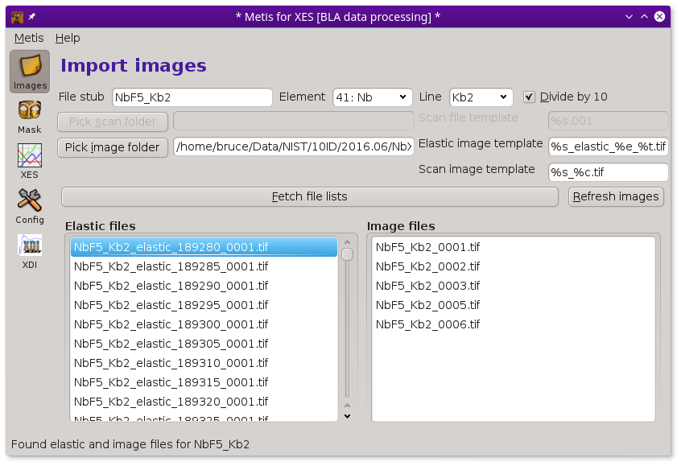

..
   The Xray::BLA and Metis document is copyright 2016 Bruce Ravel and
   released under The Creative Commons Attribution-ShareAlike License
   http://creativecommons.org/licenses/by-sa/3.0/

The Files tool
==============

To begin with :demeter:`metis`, fill in the box with the file stub.
Then click the :button:`Pick image folder,light` button.  This will
post the file selection dialog.  Use that to select the folder
containing the sequence of images measured at elastic and
(non-)resonant incidence energies.  

Make sure the boxes containing file name templates are filled in
correctly.  These are used to specify the patterns used for the
various files written during the measurement.  Getting these right is
an important part of organizing the entire data ensemble in an
interpretable way.

Finally, click the :button:`Fetch file lists,light` button.  This will
fill up the lists of elastic energy and measurement images.
Eventually, the lists will be filled in and :demeter:`metis` will be
ready to go.

   :demeter:`metis`, after fetching all the image files.

To aid in data visualization, the three controls at the top of the
Files page should be set correctly.  The two drop-down menus are used
to indicate the element and edge of the absorber.  You will be
prompted for this based on information gleaned from the elastic energy
file names

.. figure:: ../_images/metis_chooseline.png
   :target: ../_images/metis_chooseline.png
   :align: center

   The element and edge selection dialog.

Finally, the :guilabel:`Divide by 10` button is used to indicate how
to interpret the energy value part of the image files names.  In this
example, the elastic energies are indicated by ``189280``, ``189285``,
and so on.  These integers are the incident energy multiplied by 10,
i.e. 18928.0, 19828.5, and so on.  Clicking this button to the correct
state helps :demeter:`metis` interpret the file names correctly.

The templates used to recognize elastic and measurement images (as
well as the scan file name for ``herfd`` and ``rxes`` modes) are
simple substitution templates.

+------------+-----------------------------------------------------------------------------------------+
| token      | meaning                                                                                 |
+============+=========================================================================================+
| ``%s``     | Replace with the file stub,  ``NbF5_Kb2`` in this example.                              |
+------------+-----------------------------------------------------------------------------------------+
| ``%e``     | Replace with the elastic energy value.                                                  |
+------------+-----------------------------------------------------------------------------------------+
| ``%i``     | Replace with the incident energy value (used for ``rxes`` and ``herfd`` modes).         |
+------------+-----------------------------------------------------------------------------------------+
| ``%t``     | Replace with the tiff counter string, :configparam:`metis,tiffcounter`                  |
+------------+-----------------------------------------------------------------------------------------+
| ``%c``     | Replace with the energy counter, formatted with :configparam:`metis,energycounterwidth` |
+------------+-----------------------------------------------------------------------------------------+

Use the `Configuration tool <config.html>`_ to set the parameters
governing the ``%t`` and ``%c`` tokens.  If set incorrectly, the
:button:`Fetch file lists,light` button will return with an error
about not being able to find files matching the templates.

Having these file naming templates allows the user to store images
from multiple measurements in the same folder on disk.

The ``%t`` is, in practice, usually something like `0001` |nd| it is a
counter that is used by EPICS :program:`areaDetector` to number
repeated exposures of the camera.  The way the BLA spectrometer is
used, this is rarely incremented, although the number of leading zeros
might be changed.  The ``%c`` token is used in ``rxes`` and ``herfd``
modes to relate an exposure during the energy scan to the index of
that energy point in the scan file.  For ``xes`` mode, this is the
counter used for repeated exposures of the non-resonant XES image.

Once all the files have been loaded into :demeter:`metis`, click on
the Mask icon in the side bar to go to `the mask creation tool
<mask.html>`_.
