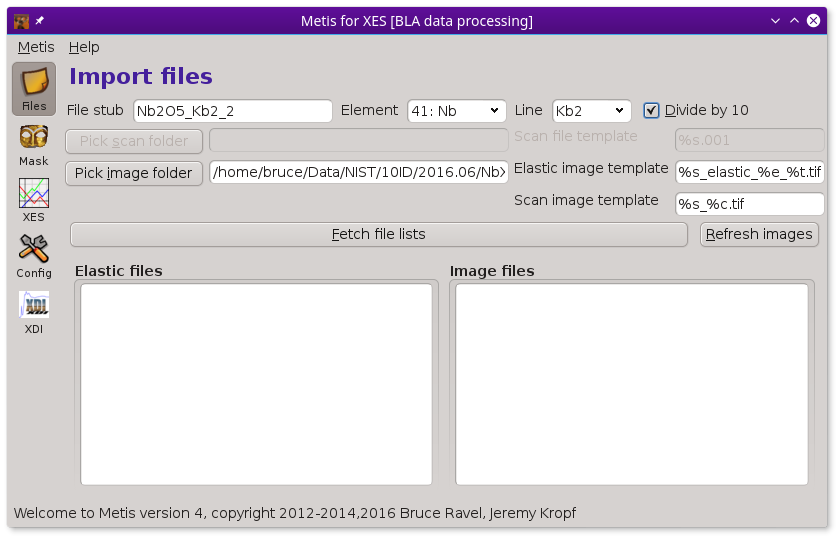
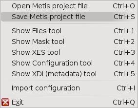
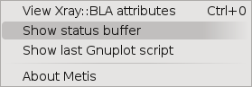

..
   The Xray::BLA and Metis document is copyright 2016 Bruce Ravel and
   released under The Creative Commons Attribution-ShareAlike License
   http://creativecommons.org/licenses/by-sa/3.0/

The Metis program
=================

The :demeter:`metis` program is modal, providing slightly different
functionality for HERFD, XES, and VRXES data sets or for individual
images.  At the command line, it is invoked with a command line
argument to put it into the correct mode.

======  ================================================
Mode    purpose
======  ================================================
xes     non-resonant emission spectroscopy
herfd   high resolution XANES
vrxes   valence band resonant emission plane
mask    process an individual elastic image
======  ================================================

To start :demeter:`metis` in XES mode, provide the ``xes`` argument:

.. code-block:: shell

   metis xes

   :demeter:`metis`, at startup, invoked in XES mode

Similarly, to begin :demeter:`metis` in ``hrfd``, ``vrxes``, or
``mask`` mode, do

.. code-block:: shell

   metis herfd
   metis vrxes
   metis mask

.. toctree::
   :maxdepth: 1

   files.rst
   mask.rst
   data.rst
   config.rst
   xdi.rst
   hdf5.rst

   The :guilabel:`Metis` menu.

The :guilabel:`Metis` menu allows you to import and export project
save files and provides alternative ways |nd| including keyboard
shortcuts |nd| to move between the tools listed in the toolbar.  There
is also an option for importing configuration information from a
`configuration file <../bla/config.html>`_ used by the command line
program.

The :demeter:`metis` project save file is a normal `HDF5 file
<hdf5.html>`_ with the :file:`.mpj` file extension.  It can be read
using any HDF5-sware tool.  It contains some simple semantics to make
it recognizable to :demeter:`metis`.

The :guilabel:`Help` menu allows you to probe the state of the current
analysis project.

   The :guilabel:`Help` menu.

The first item in the menu presents a simple text display showing the
state of the Perl object used to organize the analysis.  The second
item shows a history of status bar messages.  The third item shows the
Gnuplot commands for the most recently made plot.
