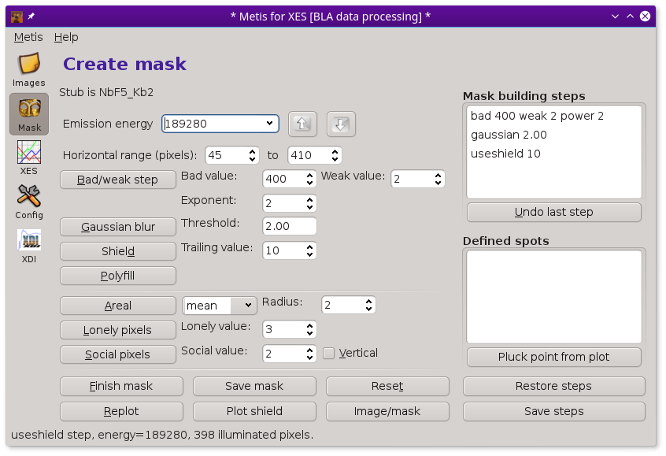
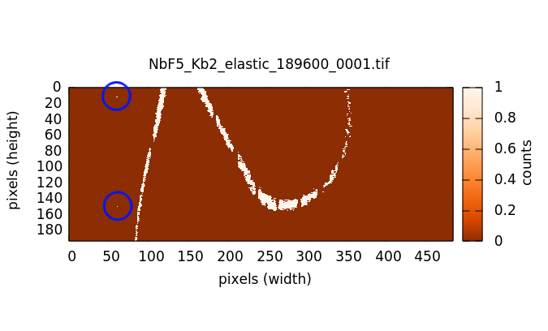
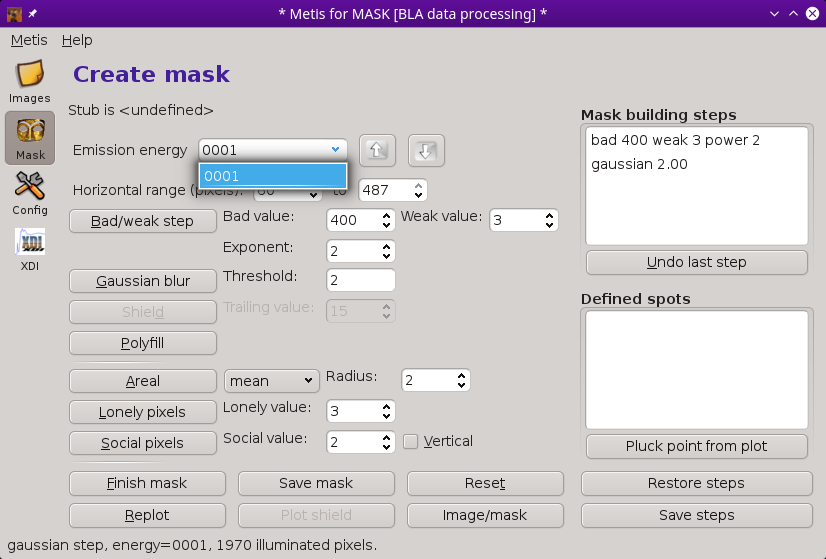

..
   The Xray::BLA and Metis document is copyright 2016 Bruce Ravel and
   released under The Creative Commons Attribution-ShareAlike License
   http://creativecommons.org/licenses/by-sa/3.0/

The Mask tool
=============

At the top of the mask creation tool is a drop-down menu showing the
entire list of measured elastic energies.  In `xes` and `rxes` mode,
the lowest elastic energy value is displayed initially.  In `herfd`
mode, the energy closest to the energy of the element and line
displayed on the Files tool is initially selected.

   :demeter:`metis`'s mask creation tool.

The purpose of this tool is define how the images measured at each
elastic energy will be turned into a mask that can then be used to
interpret the actual measurement.  

Here is an example of mask creation for the elastic measurement at
18951 eV on NbF\ :sub:`5`:

.. subfigstart::

   The measurement of the elastic scattering at 18951 eV on the NbF\
   :sub:`5` sample.

.. figure:: ../_images/nbf5_18951_mask.png
   :target: ../_images/nbf5_18951_mask.png
   :align: center

   A plausible mask for the 18951 eV measurement on the NbF\ :sub:`5`
   sample.  This was made using the bad/weak and Gaussian blur mask
   creation steps.

.. subfigend::
   :width: 0.4
   :label: _fig-nbf5mask

The end result of mask creation is a simple image wherein each pixel
has either a 0 or 1 value.  The 1-valued pixels represent the pixels
illuminated by photons of a given energy, in this case 18951.  When
the Nb XES is measured either resonantly or non-resonantly, photons of
energy 18951 will scatter through crystal in the spectrometer in the
direction of one of those pixels on the detector.

The XES image will be multiplied pixel-by-pixel by the mask.  The
pixels outside the mask will be set to 0.  The pixels within the mask
are summed and will represent the Nb XES signal measured at that
energy.

Here is how :demeter:`metis`'s mask creation tool looks when the mask
shown above is plotted:

   :demeter:`metis`'s mask creation tool with the steps for the
   creating the mask shown above.

Each step of mask creation is taken by pressing the associated button.
Many of the buttons have parameters which can be set by the user.  In
this example, the :button:`Bad/weak step,light` and :button:`Gaussian
blur,light` buttons were clicked.  Each step is written with is
parameters in the :guilabel:`Mask building steps` list on the right
side of the window.  As each button is pressed, the plot of the
elastic image is displayed with the result of the sequence of the mask
creation steps.

The bad/weak step
-----------------

The purpose of this mask creation step is to remove obviously spurious
pixels.  The :guilabel:`Bad value` indicates a pixel value which is
anomalously high, either due to a dead pixel in the camera, a
diffraction peak from the sample hitting the detector, or anything
else that causes a very high valued pixel.  All pixels above the bad
value |nd| in this example the bad value is 400 counts |nd| will be
set to 0 in the mask.  In this way, bad pixels will not affect the
resulting spectrum.

The weak value is an attempt to remove the low, fuzzy signal all
around the periphery of the image.  The assumption is that the pixels
representing the elastic scatter will each contain several counts.
Other pixels illuminated by stray photons are unlikely to have more
than one or two counts.  

Here is how the mask appears after applying the bad/weak step.  It
does a pretty good job, but leaves a lot of spurious pixels that
obviously are not part of the mask.

   The 18951 eV measurement after applying the bad/weak step.

The threshold value for bad and weak pixels are set using the controls
to the right of the :button:`Bad/weak step,light` button.  The
controls above for the :guilabel:`Horizontal range` are also used in
the bad/weak step.  By examining the elastic images from the lowest
and highest energies, you can define region at the ends of the images
which are never used in the measurement.  In the bad/weak step, the
pixels to left of the lower value of :guilabel:`Horizontal range` and
to the right of the upper value will be set to zero, thus eliminating
any spurious points from any mask that might make it through any of
the mask creation steps.

Finally, the :guilabel:`Exponent` control is used to set the value for
the exponent used to raise the elastic image to some power.  This is
done after the bad and weak pixels are removed.  The point of this is
to enhance the contrast in the case of weak elastic scattering.  When
you have a strong elastic signal, an exponent of 1 should suffice.
Note that changing the changing the exponent value will have an effect
on the appropriate value of the Gaussian threshold, described below.

The Gaussian blur step
----------------------

This step performs a two-dimensional convolution with a
pseudo-Gaussian kernel.  The kernel can be of size 3 pixels by 3
pixels or 5 by 5.  This is set by the
:configparam:`metis,gaussian_kernel` `configuration parameter
<config.html>`_.  The 3x3 kernel is

+------+------+-----+
| 1/16 | 2/16 | 1/16|
+------+------+-----+
| 2/16 | 4/16 | 2/16+
+------+------+-----+
| 1/16 | 2/16 | 1/16|
+------+------+-----+

The 5x5 kernel is

+-------+-------+------+-------+------+
| 1/271 | 4/271 | 7/271| 4/271 | 1/271|
+-------+-------+------+-------+------+
| 4/271 |16/271 |26/271|16/271 | 4/271|
+-------+-------+------+-------+------+
| 7/271 |26/271 |41/271|26/271 | 7/271|
+-------+-------+------+-------+------+
| 4/271 |16/271 |26/271|16/271 | 4/271|
+-------+-------+------+-------+------+
| 1/271 | 4/271 | 7/271| 4/271 | 1/271|
+-------+-------+------+-------+------+

At each pixel, this kernel is multiplied by the surrounding pixels.
The result is summed and the kernel is set to that summed value.  This
has the effect of suppressing pixels that do not have illuminated
neighbors while preserving those that do.

The threshold value to the right of the :button:`Gaussian blur,light`
button is used as a cut-off.  Pixels above that threshold are
preserved in the mask and set to 1.  Pixels below that threshold are
rejected and set to 0.

Here is the 18951 eV mask after a 5x5 Gaussian blur:

.. figure:: ../_images/nbf5_18951_mask.png
   :target: ../_images/nbf5_18951_mask.png
   :align: center

   The 18951 eV measurement after applying the Gaussian blur step.

Shield step
-----------

The K\ |beta|\ :sub:`2,4` emission lines being measured in this
experiment is *very* close to the absorption edge.  Towards the end of
the sequence of elastic energies, the elastic signal is being measured
very close to the absorption edge energy.  Because Nb has a large
core-hole broadening, a significant amount of fluorescence from the K\
|beta|\ :sub:`2,4` lines themselves begins showing up in the elastic
measurements.  Here is an example at 18986.5 eV (as compared to the
Nb\ :sup:`0+` edge energy of 18986 |nd| the edge for Nb\ :sup:`5+`
would be a few volts higher).

.. figure:: ../_images/nbf5_189865.png
   :target: ../_images/nbf5_189865.png
   :align: center

   The 18986.5 eV measurement.

The elastic signal is the swoop towards the bottom and right of the
image.  The brighter signal near the top and left is the K\ |beta|\
:sub:`2` signal beginning to appear due to the core-hole broadening.

The problem with the portion of the measurement coming from the K\
|beta|\ :sub:`2` signal is that the Gaussian blur filter won't
distinguish between it and the elastic signal.  Indeed, the
fluorescence part of the image is likely to be brighter than the
elastic portion as we get close to the edge.

There is a simple heuristic for distinguishing the elastic from the
fluorescence.  Any pixels in the image that were part of earlier masks
must not be part of the current mask.  Using a succession of earlier
masks, we can make a shield of pixels covered by earlier emission
energies and use that shield to remove pixels from the current mask.

Because the energy resolution is typically larger than the step size,
successive masks overlap somewhat.  The parameter associated with this
mask creation step defines how many energy steps prior to the current
should be used to add to the shield.  In this case the parameter
is 10.  Thus a shield is created by overlapping all the masks from the
initial energy to 10 energy steps prior to the current energy.  In
this example, that results in a big blob covering the top and right
portions of the image, as seen in the second image below.

The illuminated pixels in the shield are set to zero in the mask,
resulting in the mask shown in the third image below.

.. subfigstart::

.. figure:: ../_images/nbf5_189865_noshield.png
   :target: ../_images/nbf5_189865.noshieldpng
   :align: center

   The mask 18986.5 after the bad/weak and Gaussian blur steps.  The
   signal from the  K\ |beta|\ :sub:`2` remains in the mask as it
   easily passes the Gaussian blur threshold.

   The shield created from all the masks 10 energy steps before the
   current energy and earlier.

.. figure:: ../_images/nbf5_189865_mask.png
   :target: ../_images/nbf5_189865_mask.png
   :align: center

   The mask after removing the pixels covered by the shield.

.. subfigend::
   :width: 0.4
   :label: _fig-nbf5shield

The use of the shield makes it possible to distinguish the elastic
signal from the fluorescence.  However, the elastic signal is pretty
weak and relatively few pixels are left behind in this example.

The polyfill step
-----------------

In an effort to improve upon images which are sparse after the mask
creation steps already described, like the one shown above at 18986.5
eV, :demeter:`metis` offers a filling algorithm.  In each column of
the image, the top-most and bottom-most pixels remaining after the
earlier steps are identified.  A polynomial is fitted to the set of
top-most points and another polynomial is fitted to the set of
bottom-most points.  These two polynomials are extrapolated over the
range which includes the left- and right-most points used in the
polynomial fits.  All pixels between the two extrapolated polynomials
(in the vertical direction) are illuminated.

The default is to use a polynomial of order 6.  The
:configparam:`metis,polyfill_order` parameter controls the order
used.  In the example below, polynomials of order 8 were used.

.. subfigstart::

.. figure:: ../_images/nbf5_189865_mask.png
   :target: ../_images/nbf5_189865_mask.png
   :align: center

   The mask after removing the pixels covered by the shield.

.. figure:: ../_images/nbf5_189865_poly.png
   :target: ../_images/nbf5_189865_poly.png
   :align: center

   The mask after fitting polynomials or order 8 and illuminating the
   pixels between the polynomials.

.. subfigend::
   :width: 0.4
   :label: _fig-nbf5polyfill

This mask building step is helpful in situations where the mask is
sparse.  It will add many more pixels to the evaluation of the emission
image.  However, the curvature of the polynomial is might add
additional pixels to the mask.  Also any spurious points remaining in
the mask will severely impact the quality of the fitted polynomials.

The polyfill algorithm presumes that the polynomials will be
analytic functions.  If the elastic signal :quoted:`loops` on itself
such that for a given column in the image, there are two distinct,
vertically displaced regions of the mask, then the polyfill will fail
rather dramatically.

When using the polyfill step, it is prudent to examine each mask
individually and use the step removal algorithm described below
wherever necessary.

Other mask creation steps
-------------------------

There are three more mask creation steps that can be added to the mask
creation recipe.  Each of them is similar to the Gaussian blur, but
with certain differences.

#. The **areal mean step** takes a :quoted:`radius` parameter.  It
   uses an n-by-n (where n twice the parameter value +1, thus radius 2
   is a 5x5 kernel) uniform kernel to make a convolution of the image.

#. The **lonely pixel step** removes any pixels from the mask that do
   not have enough illuminated neighbors.

#. The **social pixel step** includes any pixels into the mask that
   are not illuminated, but which have a sufficient number of
   illuminate neighbors.  This step is useful for filling in gaps in a
   mask, but has the negative side effect of making the mask wider,
   thus decreasing energy resolution.

   If the :guilabel:`vertical` button is pressed, then the social
   check is only made in the vertical direction.  In that case, the
   socail value should be 1 or 2 or the step will have no effect.

The mask building steps list
----------------------------

In the upper right corner of the Mask tool is a list box containing
the mask building recipe.  As you click buttons for the various mask
building steps, the steps and any associated parameter values are
written to the list.

Step buttons can be clicked in any order, thus adding steps to the
recipe in any order.  When the XES data is processed, the mask recipe
will be applied as listed to each emission energy image in sequence.

You can move backwards through the recipe by clicking the
:button:`Undo last step,light` button.  This removes the last step
from the list, then reprocesses the image with the remaining recipe
steps.  In this way, it is easy to test different parameter values
against your actual elastic images.

Defining spots in images
------------------------

In the measurement at 18960 eV, there are a couple of bright spots in
the fuzzy bit on the left due to the early appearance of the
fluorescence signal.  These two spots are at (60,12) and (60,158).

Processing to the point of the Gaussian blur filter leaves spots in
the image that are obviously removed from the elastic signal.

.. subfigstart::

.. figure:: ../_images/nbf5_18960.png
   :target: ../_images/nbf5_18960.png
   :align: center

   The measured elastic image at 18960 eV.

   The mask after application of the bad/weak and Gaussian blur steps.
   The two spurious points are indicated by the blue circles.

.. subfigend::
   :width: 0.4
   :label: _fig-nbf5spots

There are two problems with these spurious spots.  First, they will
add signal to the measured XES at 19860 that should not be there.
Also these spots will have a profound impact on the polyfill step.
Here is what the polyfill step looks like on these data:

.. figure:: ../_images/nbf5_18960_bad.png
   :target: ../_images/nbf5_18960_bad.png
   :align: center

   The effect of outlier points on the polyfill mask creation step.

This is obviously wrong.

There are several ways of dealing with spurious spots like this.  

* In this case, since the spots arise from fluorescence, the shield
  step will be effective at removing them.  However, spots are often
  due to diffraction from the sample, in which case the shield is not
  guaranteed to be effective.

* Raising the Gaussian blur threshold also might work.  Indeed, in
  this case, raising the threshold to 1.2 is sufficient for removing
  those two spots.  Again, diffraction peaks are not amenable to
  removal by the Gaussian blur filter as they are often quite strong
  compared to the level of the elastic signal.

* Also the lonely pixels step with a value of 2 is sufficient to
  remove these spots.

With those spots removed, the polyfill step works as expected.

If you have tried all those tricks and you are unable to remove the
spots while retaining significant area in the mask, it is time for a
more hands-on approach.  For situations where other mask creation
steps don't work well, :demeter:`metis` allows you to select a
specific point in a specific elastic image and remove it from the
mask.

When you click on the :button:`Pluck point from plot,light` button,
you are prompted to double click on a spot in the image.  When you do
so, the point plucking dialog is posted.

   The point plucking dialog.

In this example, the point (58,10) is selected for energy 18960.0 eV.
Because it can be hard to hit the exact right point and because these
spots might be much larger than a single pixel, you are prompted for a
radius.  3 is the default and is often is quite big enough to fully
cover a spot.  In the example below, a radius of 10 was used along
with a weak pixel value of only 1 so that the effect of defining a
point is clearly demonstrated.

   The elastic image at 18960 eV with a large spot centered at (58,10)
   plucked out.

When the bad/weak step is processed along with the horizontal range,
the list of spots is examined and any spots defined for the current
elastic energy are also set to zero in the image, as seen above in the
upper right part of the plot.

While this method of removing spurious spots can be quite tedious, it
gives very fine-grained control over spot removal in an ensemble of
data.  For a situation where the elastic signal is not much bigger
than the background, manual spot removal might be your only choice.

Right clicking on the defined spots list posts a context menu which
can be used to edit or remove individual points from the list or to
clear the list entirely.

All the rest of the buttons
---------------------------

:button:`Finish mask,light`

   Some mask creation steps may leave pixels with values other than 0
   or 1.  This step is a final pass to verify that any non-zero pixels
   are set to unity.  This will be added automatically to the recipe
   in the steps list before data are processed in the Data tool.

:button:`Save mask,light`

   Save a mask as an image file.

:button:`Reset,light`

   Empty out the mask building steps list and restore parameters to
   their default values.

:button:`Replot,light`

   Replot the mask for the current energy.

:button:`Plot shield,light`

   Plot the shield for the current energy, if the shield step is being
   used.

:button:`Image/mask,light`

   This is a toggle button.  When toggled on, it shows the raw image
   for the current energy.  When toggled off, it replots the mask
   according to the current recipe.

:button:`Restore steps,light`

   Restore steps and spots from a save file.

:button:`Save steps,light`

   Save the current recipe of steps and spots to a save file.

RXES measurements
-----------------

The RXES measurement uses a single set of images both for making masks
and as the measured data.  The trick is to distinguish the elastic
portion of the image from the fluorescence portion.

The shield step in the mask creation process is key to this.  Here are
the masks generated from the example images shown in the explanation
of `the Files tool <files.html>`_.

.. subfigstart::

.. figure:: ../_images/pt_rxes_1.png
   :target: ../_images/pt_rxes_1.png
   :align: center

   A Pt RXES image at a low energy.

.. figure:: ../_images/pt_rxes_2.png
   :target: ../_images/pt_rxes_2.png
   :align: center

   A Pt RXES image in the middle of the image sequence.

.. figure:: ../_images/pt_rxes_3.png
   :target: ../_images/pt_rxes_3.png
   :align: center

   A Pt RXES image at the end of the image sequence.
   
.. figure:: ../_images/pt_rxes_mask1.png
   :target: ../_images/pt_rxes_mask1.png
   :align: center

   The corresponding mask for the Pt RXES image at a low energy.

.. figure:: ../_images/pt_rxes_mask2.png
   :target: ../_images/pt_rxes_mask2.png
   :align: center

   The corresponding mask for the Pt RXES image in the middle of the image sequence.

   The corresponding mask for the Pt RXES image at the end of the image sequence.
   

.. subfigend::
   :width: 0.3
   :label: _fig-ptrxes

The recipe for these masks is bad/weak with parameters 400/1/1, a
Gaussian blur filter with a threshold of 6.0, and a shield step with a
parameter of 5.  That is, the masks from 5 steps back and prior are
used to construct the shield which removes the fluorescence signal
from the mask.  The part that remains is a reasonable extraction of
the elastic signal.  The reason the shield step with a parameter of 5
can be trusted is that the mask from the end of the image sequence is
a fair representation of the stripe that corresponds to the elastic
signal.

This sequence of masks will then be applied to the same sequence of
images to extract the resonant XES signal at each energy.

Examining a single file
-----------------------

When started in ``mask`` mode, the Mask tool is mostly the same as in
other modes.

   :demeter:`metis`'s mask creation tool in ``mask`` mode.

The :guilabel:`Emission energy` list has only a single entry and the
shield step is disabled.  Otherwise, everything works the same.
