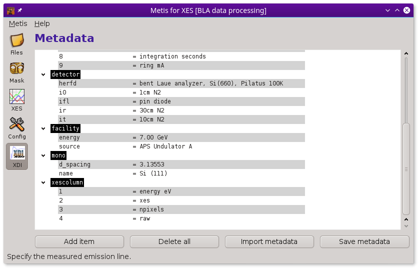

..
   The Xray::BLA and Metis document is copyright 2016 Bruce Ravel and
   released under The Creative Commons Attribution-ShareAlike License
   http://creativecommons.org/licenses/by-sa/3.0/

The XDI (metadata) tool
=======================

:demeter:`metis` uses a tree to display metadata, i.e. information
about the state of the beamline, the facility, and the sample when the
measurement was made.  When column data is written, the header will
include all the data shown here in the `XDI format
<https://github.com/XraySpectroscopy/XAS-Data-Interchange>`_.

   :demeter:`metis`'s XDI metadata tool.

This display is fully interactive, allowing you to manage and edit
your collection of metadata.  You can right click on any metadata item
to post a context menu:

   The pop up menu when right clicking on a metadata item.

:guilabel:`Edit item`

  This allows you to change the value of a metadata item.

  .. figure:: ../_images/metis_edit_item.png
     :target: ../_images/metis_edit_item.png
     :align: center

:guilabel:`Add item`

  This allows you to add a new item to the current family of metadata
  items.  It uses the same dialog box as the :guilabel:`Edit item`
  option.

:guilabel:`Delete item`

  This removes the click-upon item from the list of metadata.

At the bottom of the window are a row of buttons.

:button:`Add item,light`

  This allows you to add or edit any metadata item.  Items can be
  added to existing families or a new family can be made.

:button:`Delete all,light`

  This clears the entire list of metadata.

:button:`Import metadata,light`

  This prompts for a file in the `INI format
  <https://en.wikipedia.org/wiki/INI_file>`_ then clears the list and
  loads the contents of the selected file.

:button:`Save metadata,light`

  This exports all the metadata to an `INI style
  <https://en.wikipedia.org/wiki/INI_file>`_ file.

