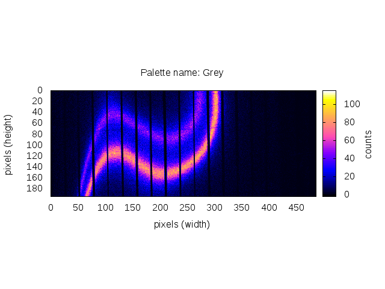
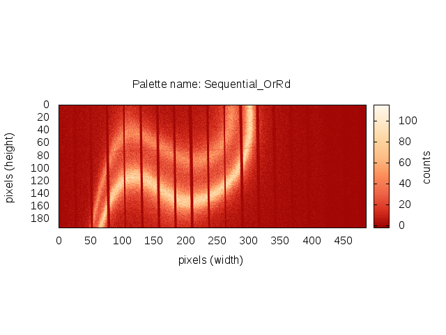

..
   The Xray::BLA and Metis document is copyright 2016 Bruce Ravel and
   released under The Creative Commons Attribution-ShareAlike License
   http://creativecommons.org/licenses/by-sa/3.0/

Options for plotting and visualization
======================================

Plotting raw images and masks
-----------------------------

:demeter:`metis` only uses single tone color palettes for plotting raw
images and masks.  Given that the raw images depict photon counts and
in masks all the pixels are either 1 or 0, there is not a lot of need
for fancy color options.  It is easiest to interpret these images with
monotone palettes.

The color scheme for raw image and mask plots is set using the
:configparam:`metis,color` configuration parameter.  If you set 
:configparam:`metis,color` to ``surprise``, :demeter:`metis` will pick
a color at random when you start the program.

Here are your color choices:

.. subfigstart::

   A raw image in grey.

.. figure:: _images/color_grey_mask.png
   :target: _images/color_grey_mask.png
   :align: center

   A mask in grey.

.. subfigend::
   :width: 0.3
   :label: _fig-grey

.. subfigstart::

.. figure:: _images/color_green_raw.png
   :target: _images/color_green_raw.png
   :align: center

   A raw image in green.

.. figure:: _images/color_green_mask.png
   :target: _images/color_green_mask.png
   :align: center

   A mask in green.

.. subfigend::
   :width: 0.3
   :label: _fig-green

.. subfigstart::

   A raw image in blue.

.. figure:: _images/color_blue_mask.png
   :target: _images/color_blue_mask.png
   :align: center

   A mask in blue.

.. subfigend::
   :width: 0.3
   :label: _fig-blue

.. subfigstart::

   A raw image in orange.

   A mask in orange.

.. subfigend::
   :width: 0.3
   :label: _fig-orange

.. subfigstart::

.. figure:: _images/color_purple_raw.png
   :target: _images/color_purple_raw.png
   :align: center

   A raw image in purple.

.. figure:: _images/color_purple_mask.png
   :target: _images/color_purple_mask.png
   :align: center

   A mask in purple.

.. subfigend::
   :width: 0.3
   :label: _fig-purple

.. subfigstart::

.. figure:: _images/color_red_raw.png
   :target: _images/color_red_raw.png
   :align: center

   A raw image in red.

   A mask in red.

.. subfigend::
   :width: 0.3
   :label: _fig-red

Surface plots of RXES
---------------------

Here is a summary of all the options for visualizing the RXES surface
plot.  :demeter:`metis` does not provide tools for fine tuning the
color distribution, but there are an awful lot of built-in options.
The palette name is the value of the
:configparam:`metis,splot_palette_name` configuration parameter.

There is more information about the palettes, where they come from,
and what the names mean at `the Graphics::Gnuplot::Palettes github
page <https://github.com/bruceravel/Graphics-Gnuplot-Palettes>`_.

.. subfigstart::

.. figure:: _images/palettes/AFMHot.png
   :target: _images/AFMHot.png
   :align: center

   The ``AFMHot`` palette from the Gnuplot palette group.

.. figure:: _images/palettes/BentCoolWarm.png
   :target: _images/BentCoolWarm.png
   :align: center

   The ``BentCoolWarm`` palette from the Moreland palette group.

.. figure:: _images/palettes/BlackBody.png
   :target: _images/BlackBody.png
   :align: center

   The ``BlackBody`` palette from the Moreland palette group.

   The ``C_grey`` palette from the CET palette group.

.. figure:: _images/palettes/C_mrybm.png
   :target: _images/C_mrybm.png
   :align: center

   The ``C_mrybm`` palette from the CET palette group.

.. figure:: _images/palettes/C_mygbm.png
   :target: _images/C_mygbm.png
   :align: center

   The ``C_mygbm`` palette from the CET palette group.

.. figure:: _images/palettes/C_wrwbw.png
   :target: _images/C_wrwbw.png
   :align: center

   The ``C_wrwbw`` palette from the CET palette group.

   The ``D_I_cjm`` palette from the CET palette group.

.. figure:: _images/palettes/D_I_cjo.png
   :target: _images/D_I_cjo.png
   :align: center

   The ``D_I_cjo`` palette from the CET palette group.

   The ``D_L_bjr`` palette from the CET palette group.

.. figure:: _images/palettes/D_L_bjy.png
   :target: _images/D_L_bjy.png
   :align: center

   The ``D_L_bjy`` palette from the CET palette group.

   The ``D_RB_bgymr`` palette from the CET palette group.

.. figure:: _images/palettes/D_bkr.png
   :target: _images/D_bkr.png
   :align: center

   The ``D_bkr`` palette from the CET palette group.

.. figure:: _images/palettes/D_bky.png
   :target: _images/D_bky.png
   :align: center

   The ``D_bky`` palette from the CET palette group.

.. figure:: _images/palettes/D_bwr.png
   :target: _images/D_bwr.png
   :align: center

   The ``D_bwr`` palette from the CET palette group.

   The ``D_cwm`` palette from the CET palette group.

.. figure:: _images/palettes/D_gwr.png
   :target: _images/D_gwr.png
   :align: center

   The ``D_gwr`` palette from the CET palette group.

.. figure:: _images/palettes/D_gwv.png
   :target: _images/D_gwv.png
   :align: center

   The ``D_gwv`` palette from the CET palette group.

   The ``Diverging_BrBG`` palette from the Brewer palette group.

.. figure:: _images/palettes/Diverging_PRGn.png
   :target: _images/Diverging_PRGn.png
   :align: center

   The ``Diverging_PRGn`` palette from the Brewer palette group.

   The ``Diverging_PiYG`` palette from the Brewer palette group.

   The ``Diverging_PuOr`` palette from the Brewer palette group.

.. figure:: _images/palettes/Diverging_RdBu.png
   :target: _images/Diverging_RdBu.png
   :align: center

   The ``Diverging_RdBu`` palette from the Brewer palette group.

   The ``Diverging_RdGy`` palette from the Brewer palette group.

.. figure:: _images/palettes/Diverging_RdYlBu.png
   :target: _images/Diverging_RdYlBu.png
   :align: center

   The ``Diverging_RdYlBu`` palette from the Brewer palette group.

   The ``Diverging_RdYlGn`` palette from the Brewer palette group.

.. figure:: _images/palettes/Diverging_Spectral.png
   :target: _images/Diverging_Spectral.png
   :align: center

   The ``Diverging_Spectral`` palette from the Brewer palette group.

.. figure:: _images/palettes/ExtendedBlackBody.png
   :target: _images/ExtendedBlackBody.png
   :align: center

   The ``ExtendedBlackBody`` palette from the Moreland palette group.

   The ``ExtendedKindlmann`` palette from the Moreland palette group.

   The ``GRV`` palette from the Gnuplot palette group.

   The ``Grey`` palette from the Gnuplot palette group.

.. figure:: _images/palettes/Hot.png
   :target: _images/Hot.png
   :align: center

   The ``Hot`` palette from the Gnuplot palette group.

   The ``I_cgo`` palette from the CET palette group.

.. figure:: _images/palettes/I_cm.png
   :target: _images/I_cm.png
   :align: center

   The ``I_cm`` palette from the CET palette group.

.. figure:: _images/palettes/Jet.png
   :target: _images/Jet.png
   :align: center

   The ``Jet`` palette from the Matlab palette group.

.. figure:: _images/palettes/Kindlmann.png
   :target: _images/Kindlmann.png
   :align: center

   The ``Kindlmann`` palette from the Moreland palette group.

   The ``L_bgyw`` palette from the CET palette group.

.. figure:: _images/palettes/L_blue.png
   :target: _images/L_blue.png
   :align: center

   The ``L_blue`` palette from the CET palette group.

   The ``L_bmw`` palette from the CET palette group.

.. figure:: _images/palettes/L_bmy.png
   :target: _images/L_bmy.png
   :align: center

   The ``L_bmy`` palette from the CET palette group.

   The ``L_gow`` palette from the CET palette group.

.. figure:: _images/palettes/L_green.png
   :target: _images/L_green.png
   :align: center

   The ``L_green`` palette from the CET palette group.

.. figure:: _images/palettes/L_grey.png
   :target: _images/L_grey.png
   :align: center

   The ``L_grey`` palette from the CET palette group.

   The ``L_kry`` palette from the CET palette group.

.. figure:: _images/palettes/L_kryw.png
   :target: _images/L_kryw.png
   :align: center

   The ``L_kryw`` palette from the CET palette group.

.. figure:: _images/palettes/L_ternary_blue.png
   :target: _images/L_ternary_blue.png
   :align: center

   The ``L_ternary_blue`` palette from the CET palette group.

   The ``L_ternary_green`` palette from the CET palette group.

   The ``L_ternary_red`` palette from the CET palette group.

   The ``Ocean`` palette from the Gnuplot palette group.

   The ``Parula`` palette from the Matlab palette group.

   The ``Pm3d`` palette from the Gnuplot palette group.

.. figure:: _images/palettes/Qualitative_Accent.png
   :target: _images/Qualitative_Accent.png
   :align: center

   The ``Qualitative_Accent`` palette from the Brewer palette group.

.. figure:: _images/palettes/Qualitative_Dark2.png
   :target: _images/Qualitative_Dark2.png
   :align: center

   The ``Qualitative_Dark2`` palette from the Brewer palette group.

.. figure:: _images/palettes/Qualitative_Paired.png
   :target: _images/Qualitative_Paired.png
   :align: center

   The ``Qualitative_Paired`` palette from the Brewer palette group.

.. figure:: _images/palettes/Qualitative_Pastel1.png
   :target: _images/Qualitative_Pastel1.png
   :align: center

   The ``Qualitative_Pastel1`` palette from the Brewer palette group.

.. figure:: _images/palettes/Qualitative_Pastel2.png
   :target: _images/Qualitative_Pastel2.png
   :align: center

   The ``Qualitative_Pastel2`` palette from the Brewer palette group.

.. figure:: _images/palettes/Qualitative_Set1.png
   :target: _images/Qualitative_Set1.png
   :align: center

   The ``Qualitative_Set1`` palette from the Brewer palette group.

.. figure:: _images/palettes/Qualitative_Set2.png
   :target: _images/Qualitative_Set2.png
   :align: center

   The ``Qualitative_Set2`` palette from the Brewer palette group.

   The ``Qualitative_Set3`` palette from the Brewer palette group.

   The ``RB_bgyr`` palette from the CET palette group.

.. figure:: _images/palettes/RB_bgyrm.png
   :target: _images/RB_bgyrm.png
   :align: center

   The ``RB_bgyrm`` palette from the CET palette group.

   The ``Rainbow`` palette from the Gnuplot palette group.

.. figure:: _images/palettes/Sequential_Blues.png
   :target: _images/Sequential_Blues.png
   :align: center

   The ``Sequential_Blues`` palette from the Brewer palette group.

.. figure:: _images/palettes/Sequential_BuGn.png
   :target: _images/Sequential_BuGn.png
   :align: center

   The ``Sequential_BuGn`` palette from the Brewer palette group.

.. figure:: _images/palettes/Sequential_BuPu.png
   :target: _images/Sequential_BuPu.png
   :align: center

   The ``Sequential_BuPu`` palette from the Brewer palette group.

.. figure:: _images/palettes/Sequential_GnBu.png
   :target: _images/Sequential_GnBu.png
   :align: center

   The ``Sequential_GnBu`` palette from the Brewer palette group.

.. figure:: _images/palettes/Sequential_Greens.png
   :target: _images/Sequential_Greens.png
   :align: center

   The ``Sequential_Greens`` palette from the Brewer palette group.

.. figure:: _images/palettes/Sequential_Greys.png
   :target: _images/Sequential_Greys.png
   :align: center

   The ``Sequential_Greys`` palette from the Brewer palette group.

   The ``Sequential_OrRd`` palette from the Brewer palette group.

   The ``Sequential_Oranges`` palette from the Brewer palette group.

   The ``Sequential_PuBu`` palette from the Brewer palette group.

   The ``Sequential_PuBuGn`` palette from the Brewer palette group.

   The ``Sequential_PuRd`` palette from the Brewer palette group.

   The ``Sequential_Purples`` palette from the Brewer palette group.

.. figure:: _images/palettes/Sequential_RdPu.png
   :target: _images/Sequential_RdPu.png
   :align: center

   The ``Sequential_RdPu`` palette from the Brewer palette group.

   The ``Sequential_Reds`` palette from the Brewer palette group.

   The ``Sequential_YlGn`` palette from the Brewer palette group.

.. figure:: _images/palettes/Sequential_YlGnBu.png
   :target: _images/Sequential_YlGnBu.png
   :align: center

   The ``Sequential_YlGnBu`` palette from the Brewer palette group.

.. figure:: _images/palettes/Sequential_YlOrBr.png
   :target: _images/Sequential_YlOrBr.png
   :align: center

   The ``Sequential_YlOrBr`` palette from the Brewer palette group.

   The ``Sequential_YlOrRd`` palette from the Brewer palette group.

.. figure:: _images/palettes/SmoothCoolWarm.png
   :target: _images/SmoothCoolWarm.png
   :align: center

   The ``SmoothCoolWarm`` palette from the Moreland palette group.

.. subfigend::
   :width: 0.15
   :label: _fig-palettes

